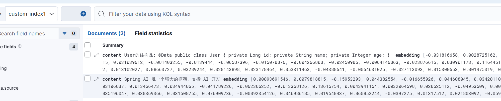
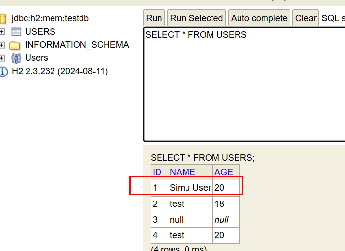

# Spring-AI有关Tool-Calling和RAG功能测试

> 测试环境：Spring Boot3 JDK17 Gradle ES8 Spring-AI版本：1.0.0-M6

有关gradle配置如下，配合科学上网可以无障碍拉取有关代码
```groovy
plugins {
    id 'java'
    id 'org.springframework.boot' version '3.4.4'
    id 'io.spring.dependency-management' version '1.1.7'
}

group = 'com.example'
version = '0.0.1-SNAPSHOT'

java {
    toolchain {
        languageVersion = JavaLanguageVersion.of(17)
    }
}

configurations {
    compileOnly {
        extendsFrom annotationProcessor
    }
}

repositories {
    mavenCentral()
//    maven { url 'https://repo.spring.io/snapshot' }
    maven { url 'https://repo.spring.io/milestone' }
    maven {
        name = 'Central Portal Snapshots'
        url = 'https://central.sonatype.com/repository/maven-snapshots/'
    }
}

ext {
    set('springAiVersion', "1.0.0-M6")
//    set('springAiVersion', "1.0.0-SNAPSHOT")
}

dependencies {

    implementation 'org.springframework.boot:spring-boot-starter-web'
    implementation 'org.springframework.ai:spring-ai-ollama-spring-boot-starter'
    // Spring Retry
    implementation 'org.springframework.retry:spring-retry:2.0.6'

    // Spring Boot AOP starter
    implementation 'org.springframework.boot:spring-boot-starter-aop'

    // Spring AOP 和 AspectJ 支持
    implementation 'org.springframework:spring-aspects'
    implementation 'org.aspectj:aspectjrt:1.9.22' // 添加 AspectJ 运行时
    implementation 'org.aspectj:aspectjweaver:1.9.22' // 添加 AspectJ 编织器


    // MyBatis
    implementation 'org.mybatis.spring.boot:mybatis-spring-boot-starter:3.0.3'
    implementation 'org.springframework.ai:spring-ai-elasticsearch-store-spring-boot-starter'

    // H2 数据库
    runtimeOnly 'com.h2database:h2'


    compileOnly 'org.projectlombok:lombok'
    annotationProcessor 'org.projectlombok:lombok'
    testImplementation 'org.springframework.boot:spring-boot-starter-test'
    testRuntimeOnly 'org.junit.platform:junit-platform-launcher'
}

dependencyManagement {
    imports {
        mavenBom "org.springframework.ai:spring-ai-bom:${springAiVersion}"
    }
}

//tasks.named('test') {
//    useJUnitPlatform()
//}

```

有关ES8环境搭建的docker-compose文件参考：
```yaml
version: '3.8'

services:
  elasticsearch:
    image: docker.elastic.co/elasticsearch/elasticsearch:8.16.6
    container_name: elasticsearch
    environment:
      - node.name=elasticsearch
      - cluster.name=es-docker-cluster
      - discovery.type=single-node
      - bootstrap.memory_lock=true
      - xpack.security.enabled=false  # 禁用安全认证
      - "ES_JAVA_OPTS=-Xms1g -Xmx1g"  # 设置JVM堆大小
    ulimits:
      memlock:
        soft: -1
        hard: -1
    volumes:
      - es_data:/usr/share/elasticsearch/data
    ports:
      - "9200:9200"
    networks:
      - elastic

  kibana:
    image: docker.elastic.co/kibana/kibana:8.16.6
    container_name: kibana
    environment:
      - ELASTICSEARCH_HOSTS=http://elasticsearch:9200  # 使用HTTP而不是HTTPS
      - xpack.security.enabled=false  # 禁用Kibana的安全功能
    depends_on:
      - elasticsearch
    ports:
      - "5601:5601"
    networks:
      - elastic

volumes:
  es_data:
    driver: local

networks:
  elastic:
    driver: bridge
```


application.yml
```yaml
spring:
  elasticsearch:
    uris: http://localhost:9200
  ai:
    embedding:
      transformer:
        enabled: true

    ollama:
      init:
#        pull-model-strategy: always
        embedding:
          additional-models:
            - nomic-embed-text
      base-url: http://localhost:11434
      chat:
        model: llama3.2:latest
      embedding:
        enabled: true
        options:
          model: nomic-embed-text
    vectorstore:
      elasticsearch:
        initialize-schema: true
        index-name: custom-index1
#        dimensions: 1536
        dimensions: 768   #ES8，这里需要改成768
        similarity: cosine
        batching-strategy: TOKEN_COUNT # Optional: Controls how documents are batched for embedding


  data:
    redis:
      host: localhost
      port: 6379
  datasource:
    url: jdbc:h2:mem:testdb
    driver-class-name: org.h2.Driver
    username: sa
    password:
  h2:
    console:
      enabled: true
      path: /h2-console
  sql:
    init:
      mode: always  # 应用启动时执行 schema.sql 和 data.sql
```

schema.sql:
```sql
CREATE TABLE users (
                       id BIGINT GENERATED BY DEFAULT AS IDENTITY PRIMARY KEY,
                       name VARCHAR(255) NOT NULL,
                       age INTEGER
);
```


## RAG功能测试
依次执行v1,v2接口，可以拿到RAG搜索结果，检查ES，发现以及存在相关数据了：


```java
package com.example.toolcalling2.controller;

import jakarta.annotation.Resource;
import org.springframework.ai.document.Document;
import org.springframework.ai.vectorstore.SearchRequest;
import org.springframework.ai.vectorstore.VectorStore;
import org.springframework.web.bind.annotation.GetMapping;
import org.springframework.web.bind.annotation.RequestMapping;
import org.springframework.web.bind.annotation.RestController;

import java.util.List;
import java.util.Map;

@RestController
@RequestMapping("/vector")
public class VectorController {
    @Resource
    VectorStore vectorStore;


    @GetMapping("/v1")
    public Object v1() {
        vectorStore.add(List.of(new Document("""
                        User的结构是: 
                        @Data
                                  public class User {
                                      private Long id;
                                      private String name;
                                      private Integer age;
                                  }
                        
                        """, Map.of("source", "User.java")),
                new Document("Spring AI 是一个强大的框架，支持 AI 开发", Map.of("source", "Spring AI")
                )));

        return "ok";
    }


    @GetMapping("/v2")
    public Object v2() {
        List<Document> results = vectorStore.similaritySearch(
                SearchRequest.builder()
                        .query("User长什么样子")
                        .topK(1) // 返回最相似的 1 个结果
                        .build()
        );

        // 3. 输出搜索结果
        System.out.println("搜索结果:");
        for (Document result : results) {
            System.out.println("文档内容: " + result.getText());
            System.out.println("元数据: " + result.getMetadata());
            System.out.println("---");
        }
        return results;
    }

}

```

## Tool-Calling功能测试

```java
    @Resource
    VectorStore vectorStore;

    @Resource
    UserService userService;

    @GetMapping("/db1")
    @Retryable(retryFor = Exception.class, maxAttempts = 3, backoff = @Backoff(delay = 500))
    public String db1(@RequestParam(defaultValue = "向User表插入一条模拟数据") String prompt) {
        String response = ChatClient.create(chatModel)
                .prompt(prompt)
                .advisors(new QuestionAnswerAdvisor(vectorStore))
                .tools(userService)
                .call()
                .content();

        System.out.println(response);
        return response;
    }


@Component
@Slf4j
public class UserService {
    @Resource
    UserMapper userMapper;

    //returnDirect = true 表示函数被大模型调用后，直接返回函数的返回值，而不是将大模型的输出结果进行返回
    @Tool(description = "Get a user by id", returnDirect = true)
    public User getUser(Long id) {
        log.info("getUser:{}", id);
        return userMapper.selectById(id);
    }

    @Tool(description = "insert a user into database", returnDirect = true)
    public String insertUser(@ToolParam(description = "User Object") User user) {
        // Insert user into database
        log.info("insertUser:{}", user);
        userMapper.insert(user);
        return "ok";
    }
}


@Mapper
public interface UserMapper {
    @Select(" SELECT id, name, age FROM users WHERE id = #{id}")
    User selectById(Long id);

    @Insert("""
             INSERT INTO users (name, age)
                    VALUES (#{name}, #{age})
            """)
    void insert(User user);
}


@Data
@Builder
public class User {
    private Long id;
    private String name;
    private Integer age;
}

```

调用 /db1接口，效果如下，可以看到大模型成功调用了UserService里面的insertUser函数，并且也正确传入了参数。
不过有时候大模型传入的参数并不正确，需要加上重试机制。
```log
2025-03-28T11:12:58.386+08:00  INFO 24044 --- [tool-calling-2] [nio-8080-exec-6] c.e.toolcalling2.tools.UserService       : insertUser:User(id=1, name=test, age=20)
"ok"
```
再次调用/db1接口，传入prompt为：“查询id=1的记录”，测试结果如下：
```log
2025-03-28T11:15:30.018+08:00  INFO 24044 --- [tool-calling-2] [nio-8080-exec-7] c.e.toolcalling2.tools.UserService       : getUser:1
{"id":1,"name":"Simu User","age":20}
```
可以看到也确实成功调用了接口，进入H2数据库控制台查看数据，能对的上


## 思考
1. 这个项目是一个基于Spring AI框架的RAG工具调用示例，它结合了Spring AI框架的RAG功能和工具调用功能，通过向Spring AI框架提供工具，实现对数据库的查询和插入操作。
2. 优点和缺点都很明显，优点是：自然语言就能操作有关数据库的接口，不要小看这一点，只要用优质的模型，语言的输入是不需要翻译的。缺点是，目前大模型还存在一定的错误率，它并不一定按照你要求的格式去调用函数，因此需要重试机制，以及考虑插入错误数据可能造成的影响